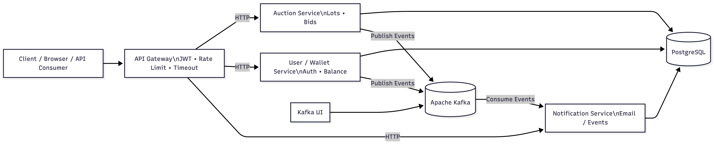

# Auction Platform (Gateway + Auction + User/Wallet + Notifications)

Платформа аукционов, реализованная на микросервисной архитектуре.

---

## Коротко о проекте

Платформа аукционов, реализованная на микросервисной архитектуре.

Проект представляет собой микросервисную платформу аукциона. 
Система состоит из API Gateway и независимых сервисов (пользователи и кошелёк, аукционы, уведомления), развёрнутых в Docker-окружении.

---

## Стек

[](https://go.dev/)
[](https://gin-gonic.com/)
[](https://gorm.io/)
[](https://www.docker.com/)
[](https://docs.docker.com/compose/)
[](https://www.postgresql.org/)
[](https://kafka.apache.org/)
[](https://github.com/provectus/kafka-ui)
[](https://jwt.io/)
[](https://pkg.go.dev/log/slog)
[](https://www.gnu.org/software/make/)

---

## Схема 



---

## Быстрый старт

1) Создайте .env в корне проекта и в корне user-wallet-service с секретом JWT (нужен для Gateway и user-wallet):

```bash
cat > .env << 'EOF'
JWT_SECRET=change-me-super-secret
EOF

docker compose up -d --build
```

---


## Мой вклад в проект

### API Gateway
- Reverse Proxy для всех микросервисов (Auth/User, Wallet, Auction, Notification)
- JWT-валидация (HS256) с прокидыванием `X-User-Id` и `X-User-Role` через headers
- Rate limiting per-user (общий и отдельный для ставок)
- Таймауты на upstream-запросы
- Kafka consumers для событий `bid_placed` и `lot_completed`
- Асинхронное создание уведомлений для пользователей
- Хранение уведомлений в PostgreSQL
- Синхронные вызовы через Gateway с единым API
- Graceful shutdown Kafka consumers
- Структурированное логирование (`slog`)
- Создание Docker Compose


## Контакты

-  Email: [islam.ch@mail.ru](mailto:islam.ch@mail.ru)
- GitHub: [@IslamCHup](https://github.com/IslamCHup)
<br><br>

**Команда**
<br>

[Адам](https://github.com/warkaz16)<br>
[Ади Умаров](https://github.com/dasler-fw)

---
